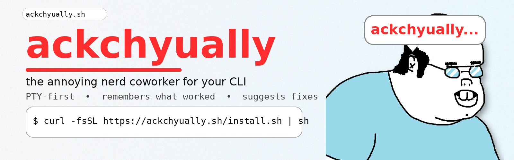

# ackchyually




**ackchyually** — the “ackchyually…” friend for your CLI. Remembers what worked (per repo). Suggests the right command when you get the details wrong.

## PTY-first (hard requirement)
If you're in a TTY, ackchyually runs tools under a real PTY. This is non-negotiable for interactive CLIs and agent shells (Claude Code / Codex CLI / Copilot CLI).

> **ackchyually:** PTY mode on (interactive).

## Install

### One-liner
```sh
curl -fsSL https://ackchyually.sh/install.sh | sh
```

### Manual
Download a release from GitHub Releases and put `ackchyually` in your PATH.

## Quickstart
1) Install shims:
```sh
ackchyually shim install git gh xcodebuild
```

2) Ensure PATH starts with shim dir:
```sh
export PATH="$HOME/.local/share/ackchyually/shims:$PATH"
```

3) Use tools normally:
```sh
git status
xcodebuild test -scheme App
```

4) Query what worked:
```sh
ackchyually best --tool xcodebuild "test"
ackchyually export --format md --tool xcodebuild
```

## What it looks like (when it’s working)

First, confirm your shell is actually using the shims:

```sh
export PATH="$HOME/.local/share/ackchyually/shims:$PATH"
hash -r

which git
# ~/.local/share/ackchyually/shims/git
```

Then, after you’ve run a successful command at least once in this repo/context, ackchyually can help when you make a “usage-ish” mistake:

```sh
$ git log -1 --pretty=%s
fix: something

$ git log -1 --prety=%s
error: unknown option `prety=%s'
usage: git log [<options>] [<revision-range>] [[--] <path>...]
ackchyually: suggestion (previous success in this repo):
  git log -1 --pretty=%s
```

Optional auto-exec (off by default):

```sh
$ export ACKCHYUALLY_AUTO_EXEC=known_success
$ git log -1 --prety=%s
ackchyually: auto-exec (known_success):
  git log -1 --pretty=%s
fix: something
```

## How it works
- Transparent PATH shims (busybox-style symlinks) so you keep typing `git ...` normally.
- Logs invocations to a local SQLite DB (redacted) keyed by repo/cwd context (`~/.local/share/ackchyually/ackchyually.sqlite`).
- On “usage-ish” failures, prints one known-good command that worked before in the same context.

## Commands
- `ackchyually shim install <tool...>`
- `ackchyually shim list`
- `ackchyually shim enable`
- `ackchyually shim uninstall <tool...>`
- `ackchyually shim doctor`
- `ackchyually best --tool <tool> "<query>"`
- `ackchyually tag add "<tag>" -- <command...>`
- `ackchyually tag run "<tag>"`
- `ackchyually export --format md|json [--tool <tool>]`

## Security
- Redaction runs before writing to the local DB.
- Export is stricter (normalizes paths, redacts more).
- Auto-exec is off by default.

### Optional auto-exec (off by default)
If you want ackchyually to automatically re-run the top known-success command on “usage-ish” failures (interactive TTY only):

```sh
export ACKCHYUALLY_AUTO_EXEC=known_success
```

## Development

```sh
just test
just test-pty
just lint
```

Maintainers: see `MAINTAINERS.md`.

## License

MIT
